# 开发板调研报告
  
**调研对象**：Lichee Pi 4A, Milk-V Mars, Milk-V Duo, 香橙派 (Orange Pi) 系列  
**调研维度**：社区活跃度、厂商支持、教学资源、使用场景与频率

## 多维度详细评估

### 1 社区活跃度 (Community Activity)

**香橙派 (Orange Pi)：依托 Armbian 的生态巨头**
* **佐证**：在全球最大的 ARM 开发板社区 **Armbian Forum** 中，Orange Pi 拥有独立版块。
* **活跃表现**：用户活跃度极高，讨论内容已不仅限于官方镜像，大量用户在讨论如何运行 **OLEDStats** (系统状态显示)、**HomeAssistant** 等应用层软件。
- 社区截图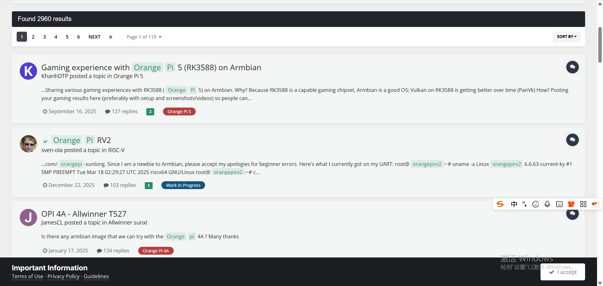
* **GitHub 现状**：虽然官方仓库 `orangepi-xunlong/wiringOP` (GPIO 控制库) 只有约 **500+ Star**，但这恰恰说明其活跃度主要下沉在第三方应用社区，而非底层驱动开发。
 - 官方仓库截图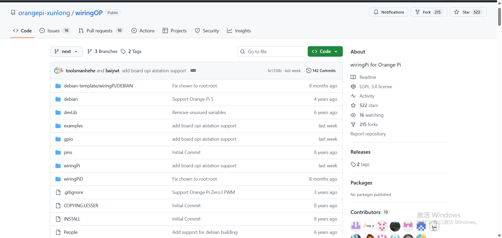

**Milk-V Duo**
* **佐证**：作为一款 RISC-V 入门板，其官方文件仓库 `milkv-duo/duo-files` 在 GitHub 上已积累 **184+ Stars**。
官方仓库截图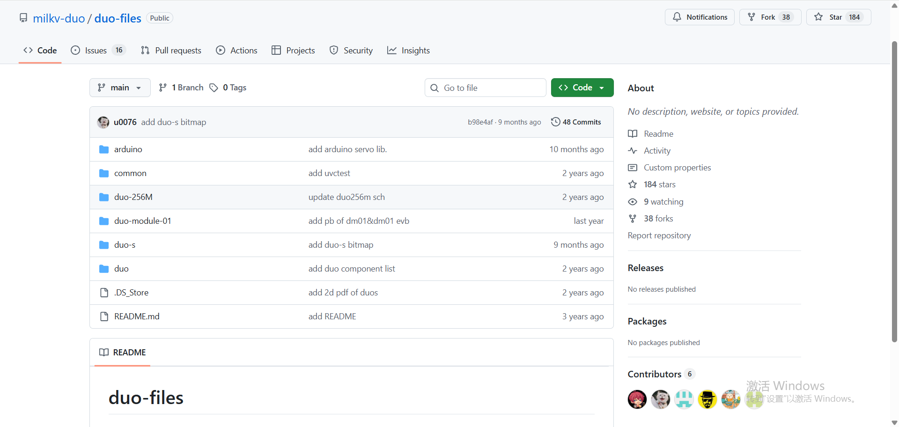
* **活跃表现**：社区呈现出明显的“项目驱动型”特征。开发者们正在积极维护 `duo-tdl-examples` (AI 推理示例) 和 `milkv-duo-smallcore-freertos` (双核实时系统)。
 - 社区截图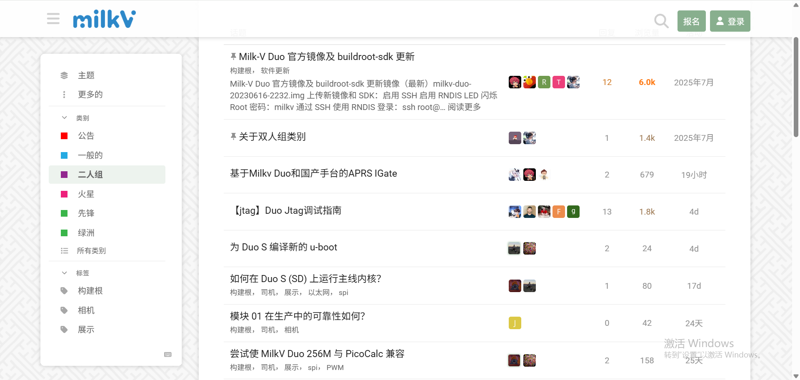
* **典型案例**：在 GitHub 和 B 站上，可以找到大量关于“小核运行 FreeRTOS”和“USB 摄像头推流”的具体实现案例，属于“小而美”的活跃圈子。

**Lichee Pi 4A**
* **佐证**：其 GitHub 核心仓库 `sipeed/LicheePi4A` 拥有约 **50 Star**，虽然绝对数字不大，但含金量极高。
 - 更新维护截图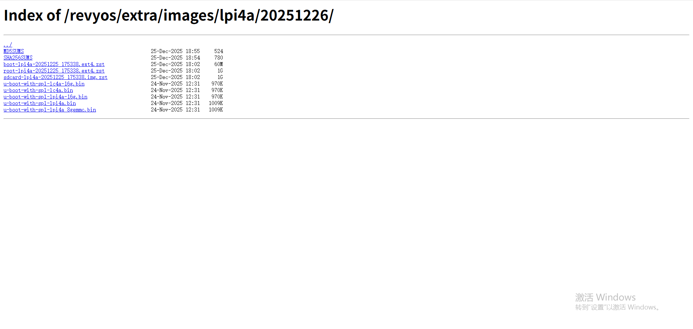
* **活跃表现**：活跃度集中在 **Linux 主线合并** 与 **第三方发行版移植**。
 - 社区截图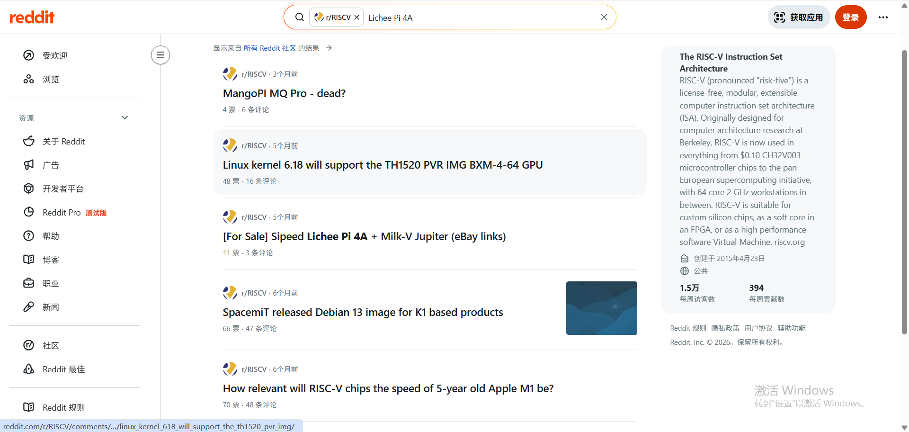
* **主要话题**：讨论多集中在 GPU 驱动适配 (`th1520-img-gpu`)、NPU 调用等底层话题，普通用户插不上嘴，但技术氛围浓厚。

**Milk-V Mars**
* **佐证**：其核心构建仓库 `milkv-mars/mars-buildroot-sdk` 在 GitHub 上仅有 **20+ Star**，这看似很少，但具有误导性。
 - 官方仓库截图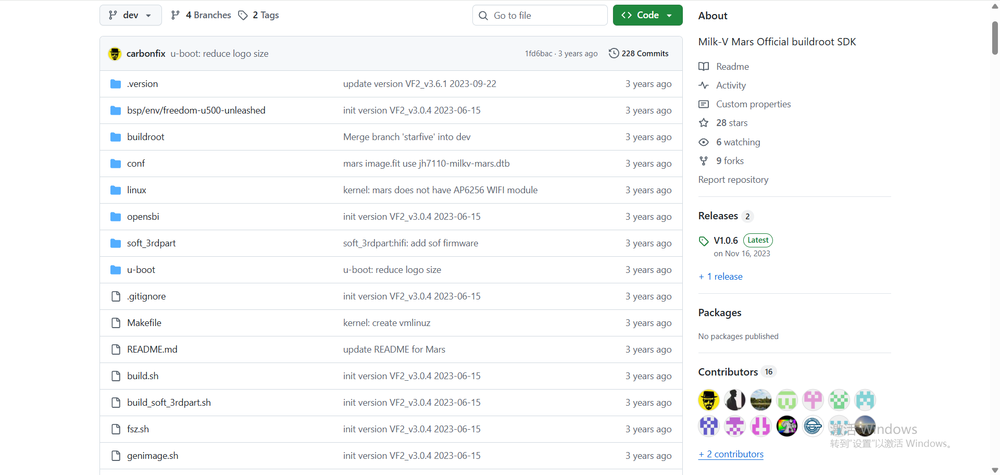
* **活跃表现**：在 Milk-V 官方论坛中，关于 Mars 的讨论集中在 **“替换树莓派 CM4”** 和 **“GPU 驱动适配”** 上。
 - 社区截图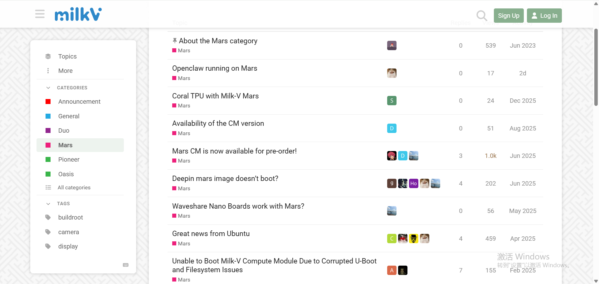
* **典型案例**：* 知名科技博主 **Jeff Geerling** 对 Mars CM 进行了深度评测，虽然指出其软件成熟度不如树莓派，但验证了其作为低功耗 RISC-V 服务器的可行性。

### 2 厂商支持

* **香橙派**：官方镜像丰富（Ubuntu, Debian, Android, OpenHarmony 等），长期维护更新，供应链极其稳定。
 - 系统镜像支持截图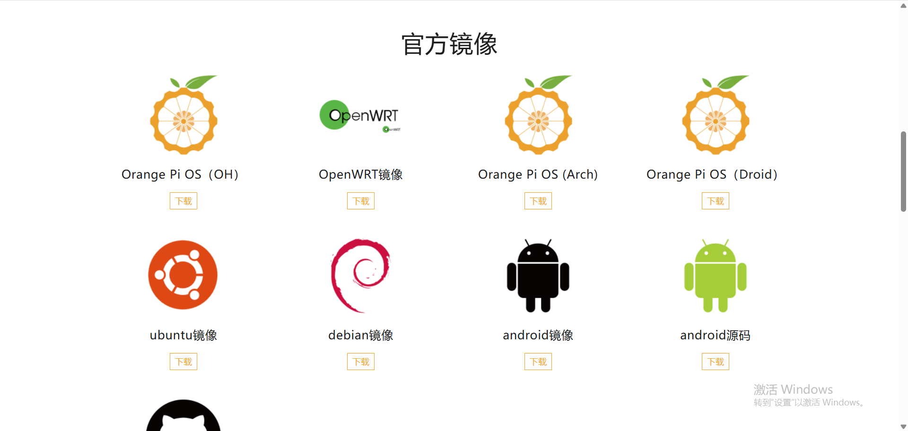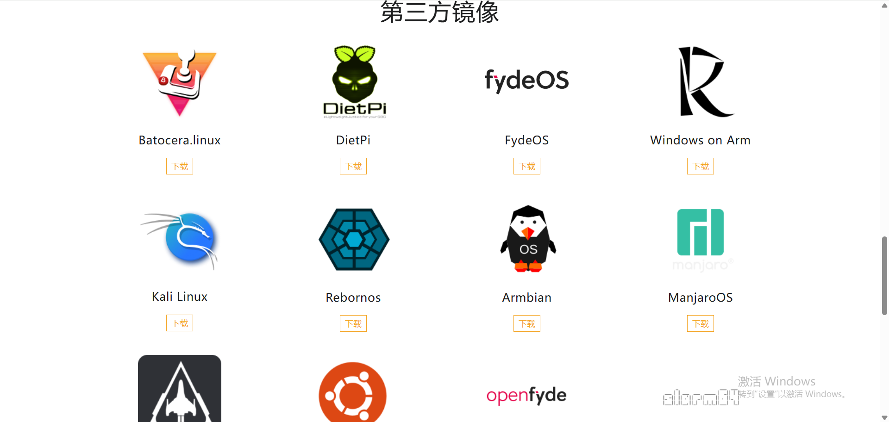
* **Milk-V (Mars/Duo)**：厂商擅长社区运营，GitHub 更新频率高，对海外开发者十分友好。针对 Duo 推出了易用的 SDK，降低了上手门槛。
 - 系统镜像支持截图 **duo**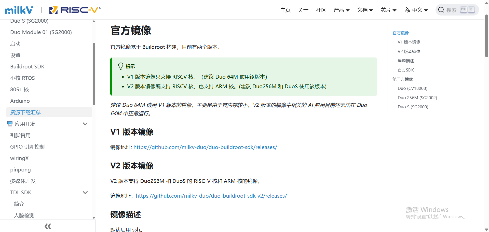
 - **mars**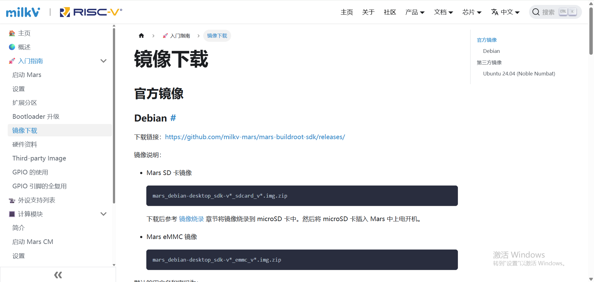

* **Lichee Pi 4A (Sipeed)**：厂商技术实力强，文档深度足够，但通常默认用户具备一定的 Linux 基础，对小白引导相对较少。
 - 开发指南截图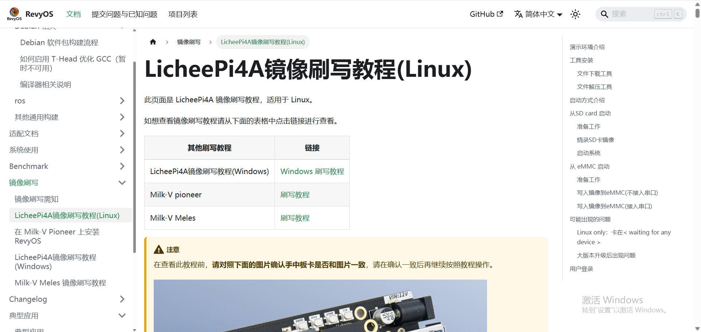

### 3 公众教学视频

 **香橙派** 从零基础刷机、服务器搭建、软路由配置到复古游戏机，应有尽有。 <https://space.bilibili.com/435974070/lists/4463507?type=season>

 **Milk-V Duo** 点灯教程、USB 摄像头传输、通过 Arduino IDE 开发、简单的 Linux 裁剪。
 <https://space.bilibili.com/98893950/lists?sid=2752437&spm_id_from=333.788.0.0>
 
 **Lichee Pi 4A** 主要是性能评测、Docker 部署演示、编译环境搭建等高阶展示。<https://www.bilibili.com/video/BV1vu411w7dE/?spm_id_from=333.337.search-card.all.click>

 **Milk-V Mars** 主要是开箱体验、基础桌面环境演示。 <https://www.bilibili.com/video/BV1EhSvBXEiq/?spm_id_from=333.337.search-card.all.click>

### 4 使用频率

* **香橙派**：**高频 / 24小时运行**。常作为家庭服务器、软路由或工控机使用，稳定性经过大规模验证。
* **Milk-V Duo**：用于具体的物联网小项目（如监控、传感器读取），适合学习嵌入式 Linux 底层逻辑。
* **Lichee Pi 4A / Mars**：主要用于 RISC-V 软件的编译、测试和移植，较少作为普通用户的日常主力设备。

### 5 兼容性分析

#### 香橙派 
* **软件好不好搞？**
    因为它用的是跟树莓派一样的 ARM 架构，基本就是**“前人栽树，后人乘凉”**。市面上的 Docker 镜像（像 MySQL、HomeAssistant 这些）99% 都有现成的 ARM64 版本，你直接 `pull` 下来就能跑，几乎没有兼容性烦恼。
* **硬件能不能插？**
    引脚定义跟树莓派基本是一个模子刻出来的。不过要注意，普通的传感器没事，但如果你要接那种**专用的屏幕或者声卡扩展板 (HAT)**，可能得改改代码库（wiringOP）或者配置一下设备树，并不是插上去就能直接干活。
* **佐证**：Docker Hub 上，ARM64 的镜像多得数不清；官方也专门搞了个 `wiringOP` 库，就是为了让你用起来感觉跟树莓派一样。

#### Milk-V Mars
* **硬件兼容性（最大卖点）**
    这板子是照着**树莓派 CM4** 做的。简单说，**它的物理尺寸和引脚跟 CM4 一模一样**。你手里如果有多余的树莓派 CM4 底板，直接把 Mars 插上去就能用。
* **软件兼容性**
    **切记：壳子虽然一样，但“里子”不同。** 它里面是 RISC-V 芯片，所以**千万别拿树莓派官方系统（Raspbian）去刷**，刷了也开不了机。你得用厂家提供的 Ubuntu 或 Debian。
* **佐证**：Jeff Geerling 的评测视频：他把 Mars 插到树莓派原厂底板上，直接点亮进系统了。

#### Lichee Pi 4A
* **软件兼容性**
    目前 RISC-V 板子里的**性能扛把子**。在板子上直接编译 OpenCV 这种大软件都毫无压力，装软件用 `apt install` 就行，感觉跟用普通电脑差不多。不过要注意，如果你要搞 3D 渲染或者用 NPU 跑 AI，得用厂家专门的 SDK，不像通用软件那么省心。
* **硬件兼容性**
    它是“核心板+底板”的设计。虽然也有引脚，但**千万别把树莓派的 5V 配件直接盲插上去！** 它的电压逻辑跟树莓派不一样（设计了 1.8V/3.3V 切换），乱插容易直接把板子烧了。
* **佐证**：Sipeed 官方 Wiki 里专门有一章讲怎么跳线设置电压，红字标粗警告你别插错电压。

#### Milk-V Duo
* **软件兼容性**
    **别把它当电脑用！** 它只有 64MB 内存，**跑不了 Docker，也跑不动完整的 Python**。你就把它当成一个“能跑 Linux 的单片机”来用。它运行的是极其精简的系统（Buildroot），适合写点小脚本控制硬件，别指望它能跑大程序。
* **硬件兼容性**
    这就好玩了，它长得跟 Arduino Nano 一样，**可以直接插在面包板上做实验**，对电子 DIY 玩家特别友好。不过它的引脚电流比较小，想驱动电机之类的大件，记得加驱动模块，不然带不动。
* **佐证**：官方 GitHub 的示例代码，专门搞了个 `Pinpong` 库来控制硬件。