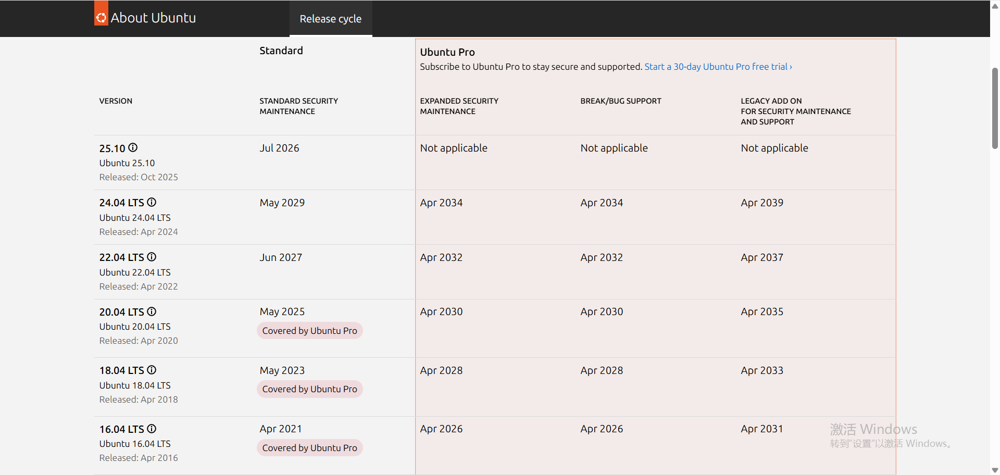
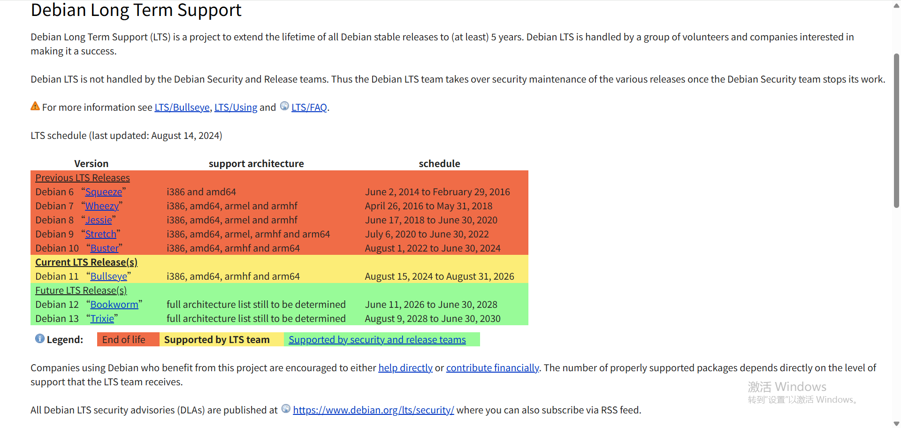
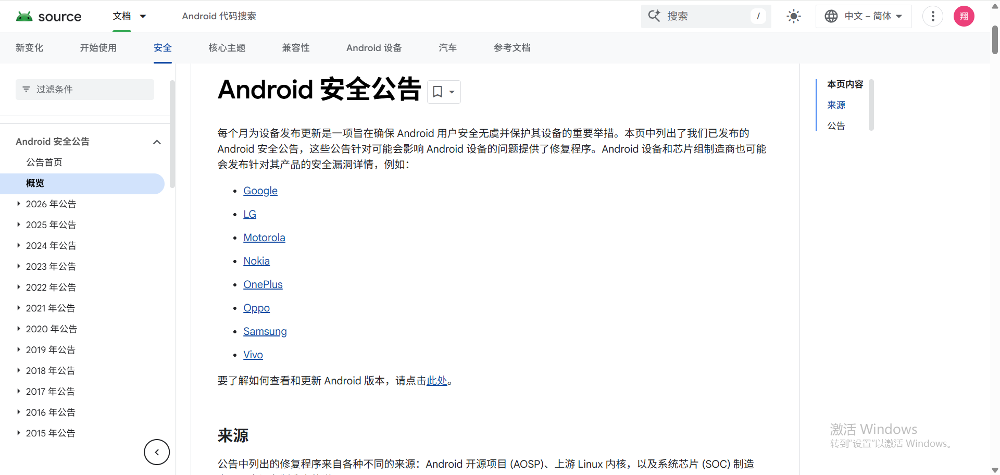

# 操作系统维调研报告

## 1. 调研背景

操作系统 (OS) 的生命周期直接决定了嵌入式产品的存活时间。若选用了即将停止维护 (End of Life, EOL) 的系统版本，将面临**无法安装软件**、**安全漏洞无法修补**以及**新硬件驱动不兼容**等致命风险。

## 2. 主流 OS 维护

### 2.1 Ubuntu

Ubuntu 是目前商业支持最完善的 Linux 发行版，分为 **LTS (长期支持版)** 和 **Interim (短期迭代版)**。

* **维护周期**：
    * **LTS (Long Term Support)**：每两年发布一次（如 20.04, 22.04, 24.04）。提供 **5年** 免费标准安全维护，企业用户可购买 ESM 服务延长至 **10年**。
    * **Interim (短期版)**：每半年发布一次（如 23.10）。仅提供 **9个月** 维护。
     - 官方图表

### 2.2 Debian

Debian 以“稳定性”著称，其版本迭代策略较为保守，适合无人值守的工控设备。

* **维护周期**：
    * **Stable (稳定版)**：发布后由官方安全团队提供约 **3年** 的全面支持。
    * **LTS (长期支持)**：由志愿者团队接手，额外提供 **2年** 安全维护，总计约 **5年**。
     - 官方图表

### 2.3 Android (AOSP)

Android 系统高度依赖芯片厂商（如 Rockchip, Allwinner）的 SDK 更新。

* **维护周期**：
    * Google 每年发布一个大版本（Android 12, 13, 14...）。
    * **安全补丁 (Security Bulletins)**：Google 每月发布，但通常只覆盖最新的 3-4 个大版本。
     - 官方维护公告

## 3. 系统停止维护的影响

一旦操作系统进入 EOL 状态，开发工作将面临以下不可逆的阻碍：

### 3.1 软件源失效 (Repo 404 Error)
* **现象**：执行 `apt-get update` 或 `pip install` 时出现 `404 Not Found` 错误。
* **后果**：官方关闭了源服务器。开发者无法安装 `git`, `vim`, `gcc` 等基础工具，开发环境彻底瘫痪。虽然可以手动修改为归档源 (old-releases)，但速度极慢且不再有更新。

### 3.2 安全裸奔 (Security Vulnerability)
* **现象**：爆发新的系统级漏洞（如 OpenSSL 心脏滴血、Dirty COW 提权漏洞）。
* **后果**：EOL 系统收不到任何补丁。对于联网设备（如软路由、网关），极易被黑客扫描并入侵，沦为肉鸡。

### 3.3 新硬件不兼容 (Hardware Incompatibility)
* **现象**：项目后期需要更换新的 USB WiFi 6 网卡或新款摄像头。
* **后果**：旧系统的 Linux 内核（如 4.4）太老，没有内置驱动。尝试自行编译驱动时，往往因 GCC 版本过低或依赖库缺失而报错，陷入死循环。

## 4. 总结与建议

**Ubuntu LTS**  5-10年维护，软件生态最全，资料最多。 
**Debian Stable**  极致稳定，不会因更新导致系统崩溃。
**Android**  需确认芯片厂商 SDK 的更新承诺。

